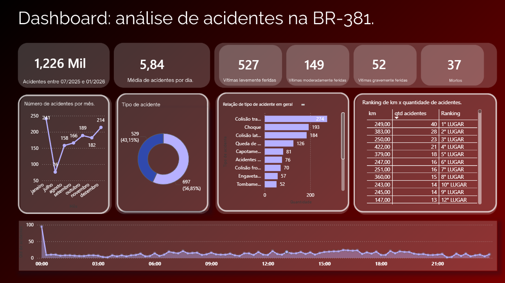

📊 Meu Primeiro Projeto de Análise de Dados

Este repositório reúne meu primeiro projeto prático de análise de dados, onde explorei acidentes ocorridos na BR-381 entre julho de 2025 e janeiro de 2026.

O objetivo foi aplicar conceitos básicos de análise exploratória de dados e desenvolver minhas habilidades nas ferramentas clássicas para análise de dados utilizando um dataset real.

🚀 Ferramentas x Habilidades Desenvolvidas

SQL → Realizei consultas elaboradas, utilizei funções agregadoras (SUM, COUNT), trabalhei com datas e horários, apliquei ORDER BY para ordenação, usei funções de concatenação, construí subconsultas mais complexas e filtros avançados com WHERE, BETWEEN e LIKE.

Google Sheets → Consultei e preparei a base inicial para análise.

Power BI → Desenvolvi dashboards interativos, criei visualizações em tabelas, utilizei DAX para filtros e cálculos, estabeleci relações entre tabelas e construí relatórios visuais que facilitaram a leitura e interpretação dos resultados.

🎯 Aprendizados

Além de exercitar técnicas de análise, este projeto marcou minha jornada inicial no mundo dos dados: desde importar arquivos e estruturar tabelas até pensar em como contar uma história clara por meio de gráficos e dashboards.

Link do dashboard: https://alunocefetmgbr-my.sharepoint.com/:u:/g/personal/miguel_carvalho_aluno_cefetmg_br/IQA6sUwouu5CSoeqZvBt7ClwAYWCONfeKTwnR2-MBAtK9dc?e=IziQaj

Base de dados utilizada: https://dados.antt.gov.br/dataset/acidentes-rodovias/resource/5d0809f2-e62d-4260-8d2c-dd284d64ea44

🤓 Se você quer saber mais detalhes de como foi a minha experiência e/ou detalhes sobre a construção desse projeto, eu escrevi sobre na minha página no Medium: https://medium.com/@miguelaugustot.carvalho/meu-primeiro-projeto-de-an%C3%A1lise-de-dados-um-breve-panorama-de-acidentes-ocorridos-na-br-381-c04d65d5b4a4?postPublishedType=repub.
